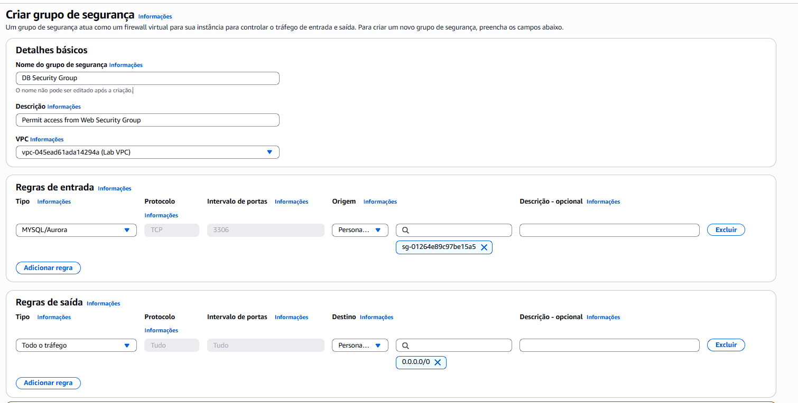
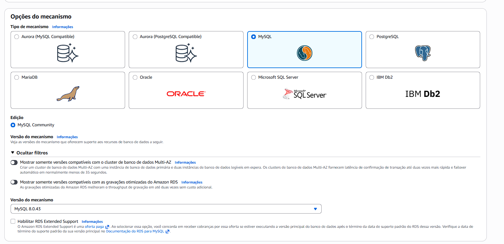
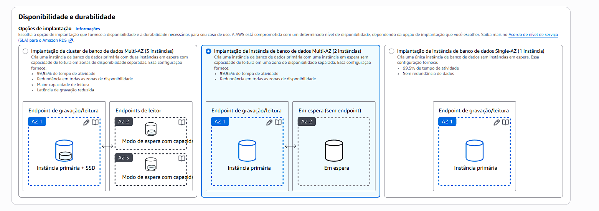
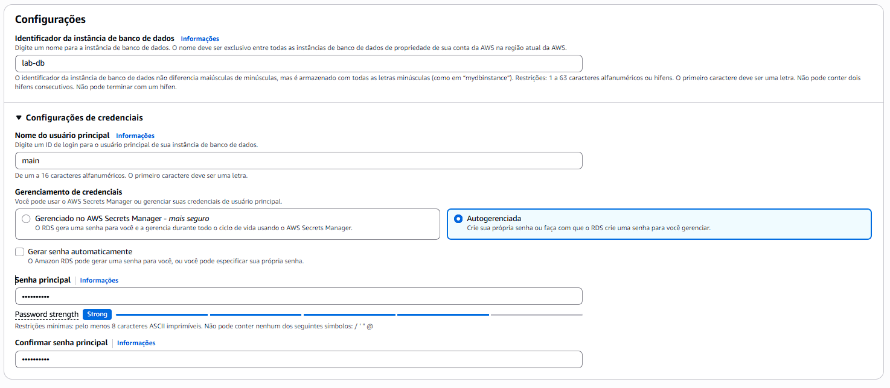
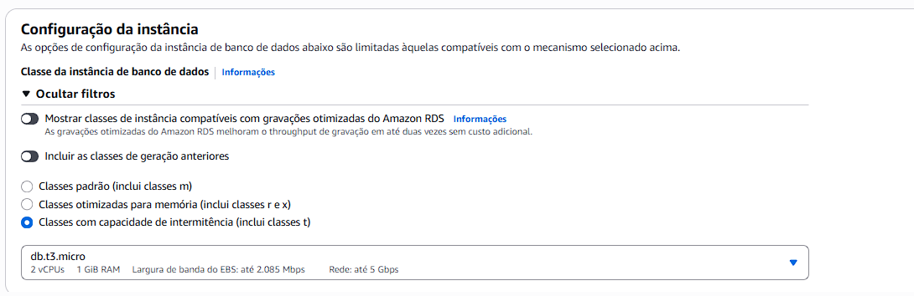
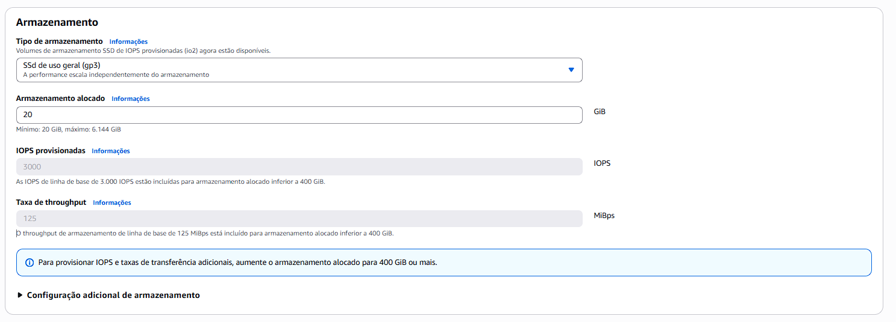
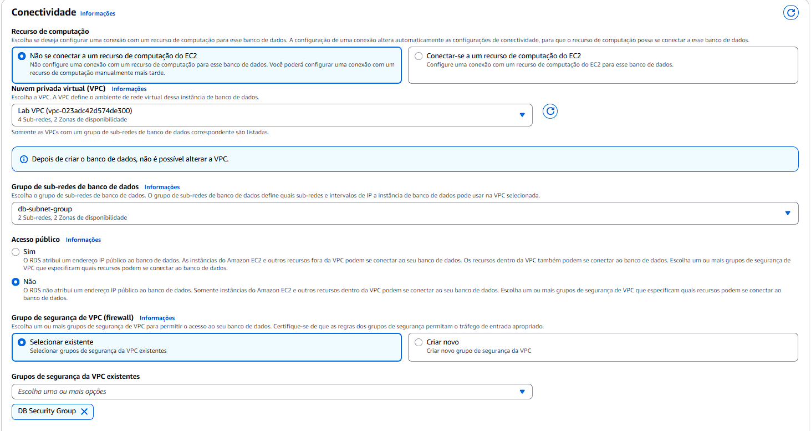

# Laboratório AWS RDS Multi-AZ com MySQL e Aplicação Web

## 📌 Visão Geral
Documentação de um laboratório que demonstra o uso do Amazon RDS (MySQL) em implantação Multi-AZ, com foco em alta disponibilidade, segurança e boas práticas na AWS. O banco de dados é integrado a uma aplicação web hospedada em uma instância EC2, garantindo redundância e tolerância a falhas.

---

## 🎯 Objetivos do Laboratório
Ao final deste laboratório, foi possível:

- Criar uma instância do **Amazon RDS MySQL** com alta disponibilidade (Multi-AZ)
- Configurar **grupos de segurança** para controlar o acesso ao banco de dados
- Criar um **grupo de sub-redes** para o RDS em múltiplas Zonas de Disponibilidade
- Integrar uma aplicação web hospedada em uma instância **EC2** ao banco de dados
- Executar operações de **inserção, edição e remoção de dados (CRUD)** por meio da aplicação web

---

## 🏗️ Arquitetura Utilizada
A arquitetura do laboratório é composta pelos seguintes recursos:

- **Amazon VPC** dedicada ao ambiente do laboratório  
- **Amazon RDS MySQL** em modo Multi-AZ  
- **Grupos de segurança** para controle de tráfego entre EC2 e RDS  
- **Grupo de sub-redes do RDS** distribuído em duas Zonas de Disponibilidade  
- **Instância EC2** executando uma aplicação web de catálogo de endereços  

A comunicação entre a aplicação e o banco de dados ocorre de forma privada e segura dentro da VPC.

---

## 1️⃣ Criação do Grupo de Segurança

Foi criado um **Security Group** para permitir que o servidor web acesse o banco de dados RDS de forma segura.

### Configurações

- **Nome:** DB Security Group  
- **Descrição:** Permit access from Web Security Group  
- **VPC:** Lab VPC  

### Regra de Entrada

- **Tipo:** MySQL/Aurora (3306)  
- **Origem:** Web Security Group  

Essa regra permite conexões ao banco de dados apenas a partir das instâncias EC2 associadas ao grupo de segurança da aplicação web.

---

## 2️⃣ Criação do Grupo de Sub-redes do Banco de Dados

Foi criado um **DB Subnet Group** para definir em quais sub-redes o Amazon RDS pode ser provisionado, garantindo disponibilidade em múltiplas Zonas de Disponibilidade.

### Configurações

- **Nome:** DB-Subnet-Group  
- **Descrição:** DB Subnet Group  
- **VPC:** Lab VPC  

### Sub-redes Selecionadas

- **Zonas de Disponibilidade:** us-east-1a e us-east-1b  
- **CIDR das Sub-redes:**  
  - **10.0.1.0/24**  
  - **10.0.3.0/24**  

Esse grupo de sub-redes foi utilizado na criação da instância RDS na etapa seguinte.

---

## 3️⃣ Mecanismo do Banco de Dados

A instância de banco de dados foi criada utilizando o **Amazon RDS** com o mecanismo **MySQL**, configurado para um ambiente de **desenvolvimento e testes (Dev/Test)**.

A opção de **implantação Multi-AZ** foi selecionada para garantir maior disponibilidade e durabilidade dos dados. Nessa configuração, o Amazon RDS cria automaticamente uma instância primária e mantém uma réplica síncrona em outra Zona de Disponibilidade.

  

---

## 4️⃣ Configurações da Instância de Banco de Dados

Em **Configurações**, foram definidos os seguintes valores:

- **Identificador da instância de banco de dados:** `lab-db`
- **Nome do usuário principal:** `main`
- **Senha principal:** `*****`
- **Confirmar senha:** `*****`

---

## 5️⃣ Classe da Instância e Armazenamento

### Classe da Instância de Banco de Dados

Foi utilizada uma classe com capacidade de intermitência, adequada para ambientes de laboratório:

- **Classe da instância:** `db.t3.micro`

### Armazenamento

As seguintes configurações de armazenamento foram aplicadas:

- **Tipo de armazenamento:** Uso geral (SSD)
- **Armazenamento alocado:** 20 GB

---

## 6️⃣ Conectividade

A conectividade da instância RDS foi configurada dentro da **VPC Lab VPC**, garantindo comunicação privada entre os recursos.

### Configurações Aplicadas

- **VPC:** Lab VPC  
- **Grupo de segurança:** DB Security Group  
- **Ação:** Grupo de segurança padrão removido  

Essa configuração garante que o acesso ao banco de dados seja restrito apenas aos recursos autorizados.

---

## 7️⃣ Monitoramento e Configurações Adicionais

Para agilizar a implantação da instância RDS no laboratório, algumas opções foram ajustadas.

### Monitoramento

- **Monitoramento avançado:** desativado  

### Configurações Adicionais

- **Nome do banco de dados inicial:** `lab`  
- **Backups automáticos:** desativados  
- **Criptografia:** desativada  

Essas configurações foram utilizadas apenas para fins de laboratório e não são recomendadas para ambientes de produção.

